# Jody's Plant Blog

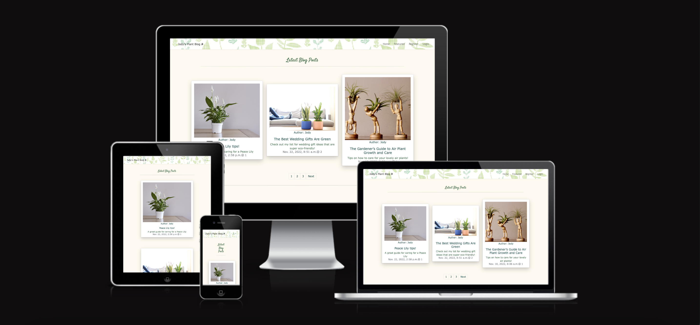

This is a blog for plant lovers, the site includes blog-like posts, sign-up and edit profile section, featured posts and a newsletter sign-up. Also included is a feature for admin to easily edit and delete blog posts from each blog post page.

This project is the fourth of five projects that needs to be completed in order to receve a diploma in Software Development from The Code Institute.

A live version of this website will be found here: https://jodys-plants.herokuapp.com/

## Table of Contents ##

UX

- [User Demographic](#user-demographic "User Demographic")
- [Site Goals](#site-goals "Site Goals")
- [User Goals](#user-goals "User Goals")
- [Audience](#audience "Audience")

User Stories

- [Site User Stories](#site-user-stories "Site User Stories")
- [Admin Stories](#admin-stories "Admin Stories")

Design

- [Colour Scheme](#colour-scheme "Colour Scheme")
- [Typography](#typography "Typography")
- [Wireframes](#wireframes "Wireframes")
- [Images](#images "Images")

Features

- [NavBar](#navbar "NavBar")
- [Home Landing Page](#home-landing-page "Home Landing Page")
- [Featured Posts](#featured-posts "Featured Posts")
- [Profile Page](#profile-page "Profile Page")
- [Sign-in](#sign-in "Sign-in")
- [Register](#register "Register")
- [Newsletter](#newsletter "Newsletter")
- [CRUD](#crud "CRUD")
- [Defensive Design](#defensive-design "Defensive Design")

Technologies Used

- [Languages Used](#languages-used "Languages Used")
- [Python Libraries and API](#python-libraries-and-api "Python Libraries and API")
- [Storing Data](#storing-data "Storing Data")

Testing

- [Validator testing](#validator-testing "Validator Testing")
- [Testing and bugs](#testing-and-bugs "Testing and bugs")
- [Fixed Bugs](#fixed-bugs "Fixed Bugs") 
- [Unfixed Bugs](#unfixed-bugs "Unfixed Bugs")
- [Future plans to implement](#future-plans-to-implement "Future plans to implement")

Deployment

- [Deployment](#deployment "Deployment")

Acknowledgements

- [Acknowledgements](#acknowledgements "Acknowledgements")

Sources

- [Sources](#sources "Sources")

------------------------------------------------------------------------------------------------------------

## UX 

### User Demographic

This application has been designed for users of all ages who love to garden and learn new things about plants.
It also includes a feature to create and personalise a profile with a profile picture and a biography entry, and with this you can comment on blog posts, to give more advice or ask questions!

### Site Goals

To build a platform to allow users to read blog posts, make a profile and comment on posts and allow them to also sign up for a newsletter sent to their email. Also included is admin access through the website for the admin to add, update or delete posts from each blog post page. Which allows the admin to easily see how a post would look with just the click of a button.

### User Goals
To engage with topics that interest them, make a personalised profile to feel welcome to the site and encourages them to explore the site and all it has to offer.

### Audience
For anyone who has an interest in plants and gardening of all sorts! Users of all ages and all levels of skills in gardening.

## User Stories

### Site User Stories

### Admin Stories

## Design

### Colour Scheme

The colour scheme chosen works with the theme of the topic chosen for the website. 
- The colour chosen for headings is #2F6844.
- The background colour is an easy on the eyes light green #FFFAF0.
- And the hovered over buttons turn a light shade of grey thanks to bootstrap secondary theme.

 

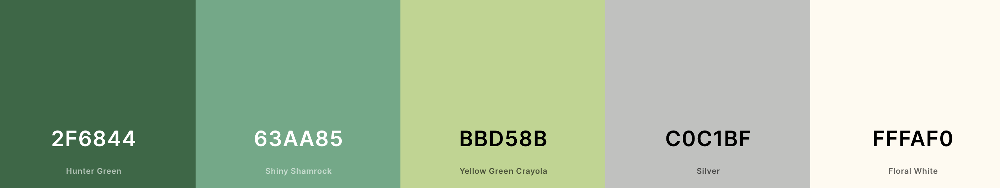

### Typography

All fonts are from the Google Fonts library.The following fonts were chosen for the page:

- 'Trebuchet MS', 'Lucida Sans Unicode', 'Lucida Grande', 'Lucida Sans', Arial, sans-serif for the navbar.
- Satisfy font for each page heading and the heading for the user's profile page.
- Verdana, Geneva, Tahoma, sans-serif for the body font and content.
- Pacifico font for the headings in the "health" section on the home page.

### Wireframes

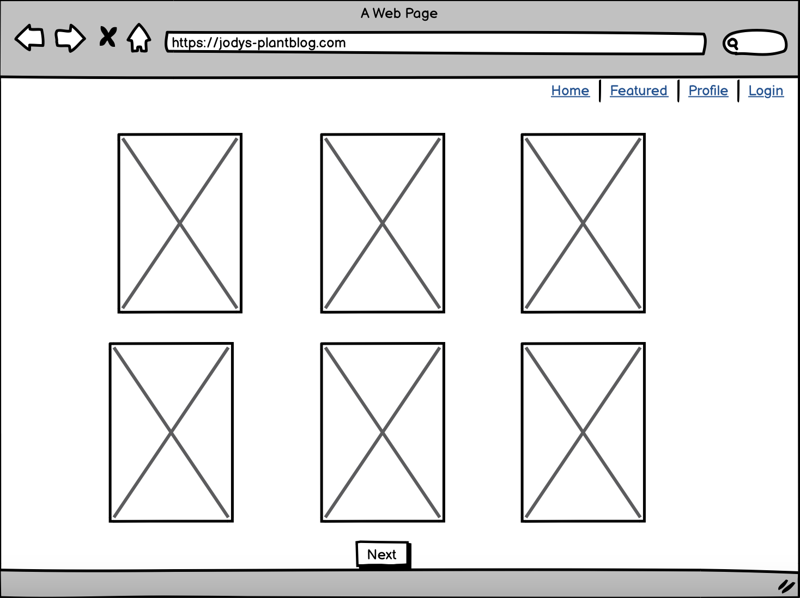

 

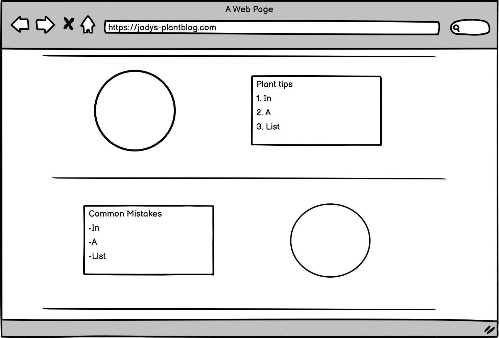

 

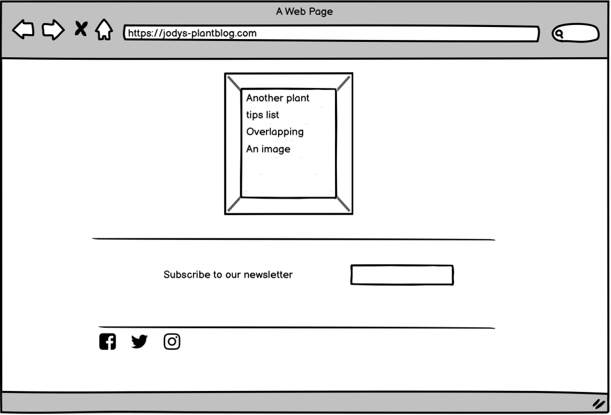

### Images

- All images were found through google and stored using Cloudinary.

## Features

### NavBar

- The Navbar is sticky, so it can show login options constantly and home page redirection.

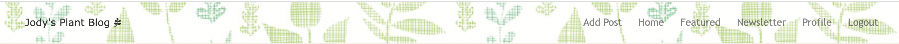

- For responsive design, the Navbar collapses into a dropdown menu for screens 768px and below.

### Home Landing Page

- The landing/home page brings you to the blog posts.
- Each card brings you to the blog post page, featuring tips, images and a comment and like section.

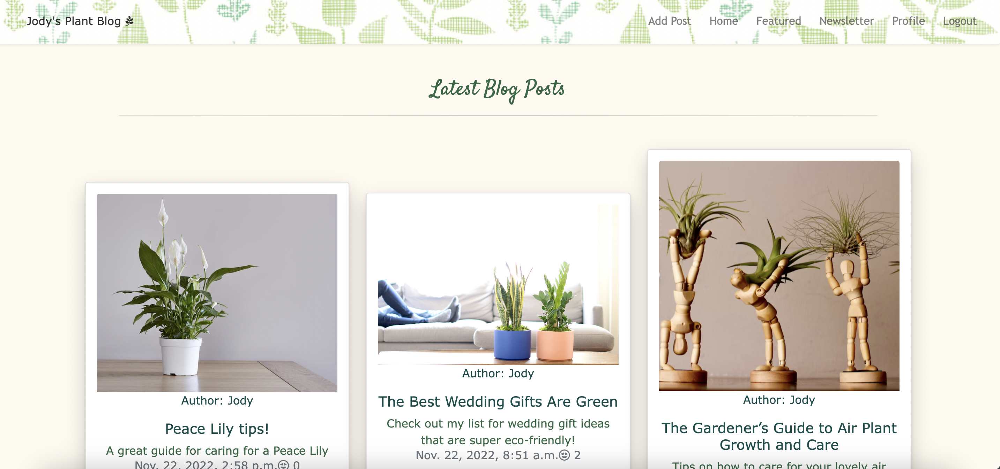
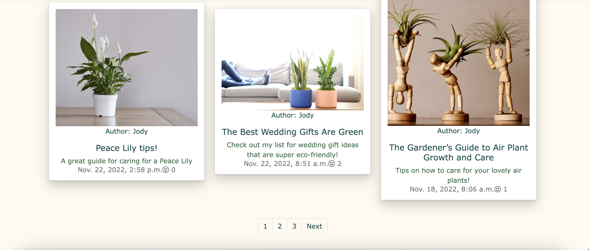

- Scrolling down the index page we have a "Quick Tips Section":

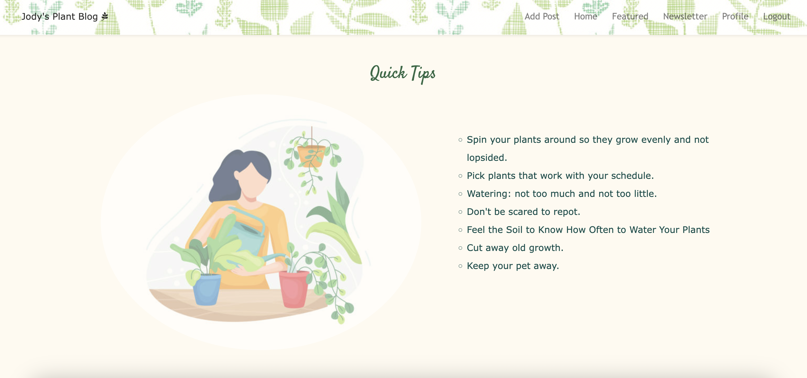

- A common mistakes section:

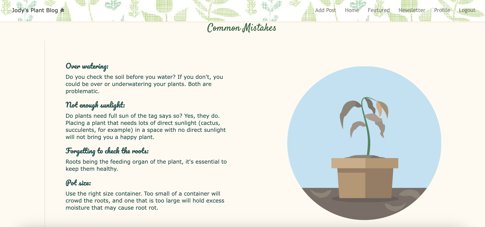

- A section on why plants are good for your health:

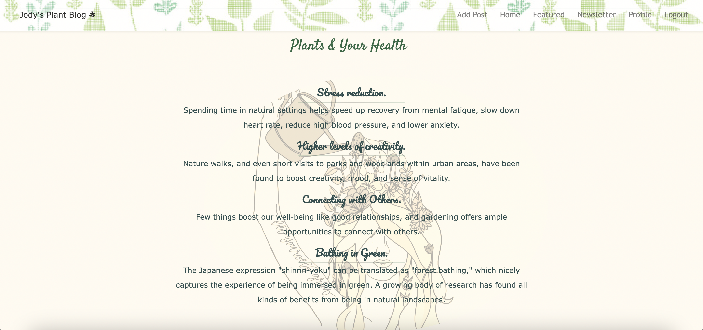

- And finally for the landing page, the Footer:

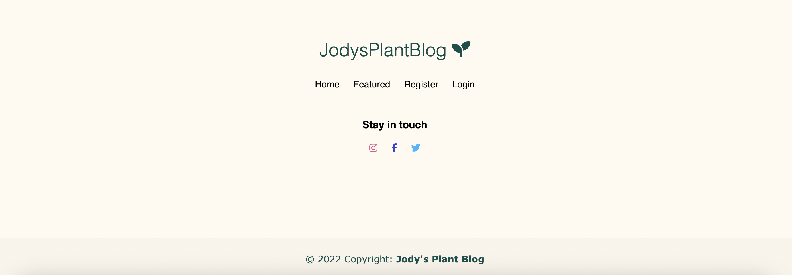

### Featured Posts 

- Featured posts is an option in the Navbar and brings you to a HTML with two cards, which would ideally be changed seasonly.

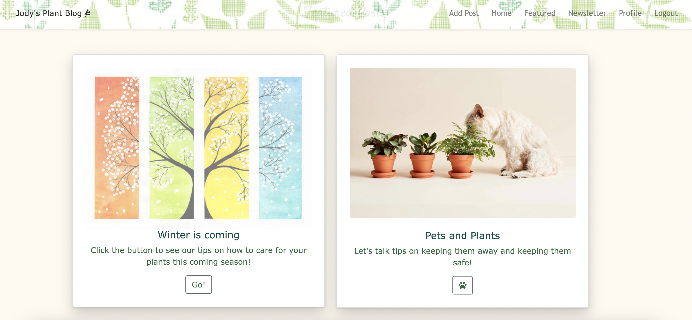

- The first Featured Post is called "Winter is Coming":

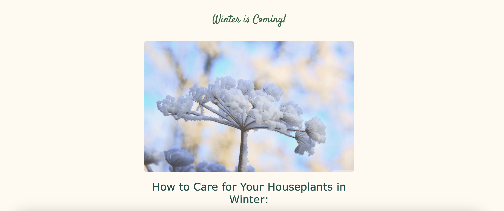

- The other card features a post all regarding pets and their safety, along with how to keep the plants safe too!

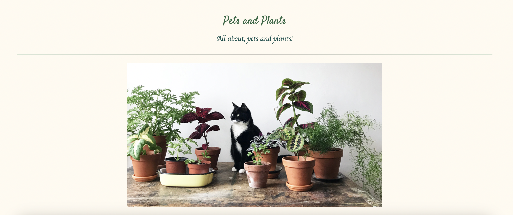

### Profile Page

- Once you sign up to a profile, you'll get redirected to your very own Profile page which you can edit by adding your name, profile picture and a bio!
- Also featured is a message that pops up indicating a successful login!

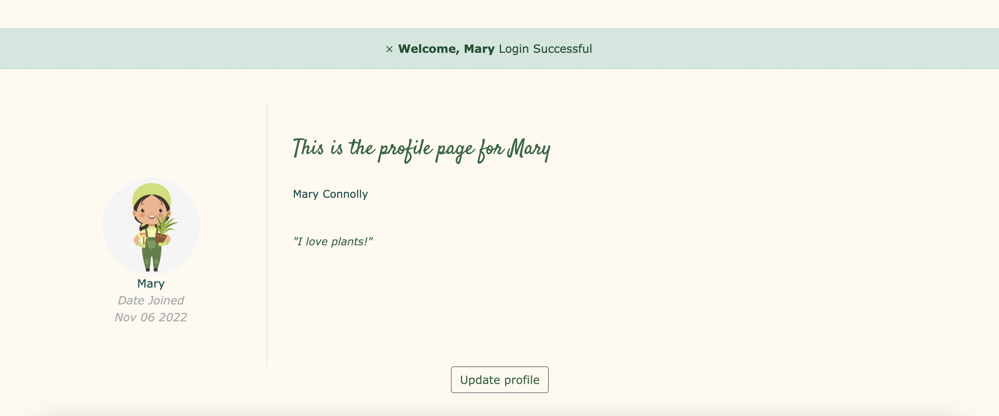

- Here is the edit profile page:
- Updating your profile will show a success message on the index page.

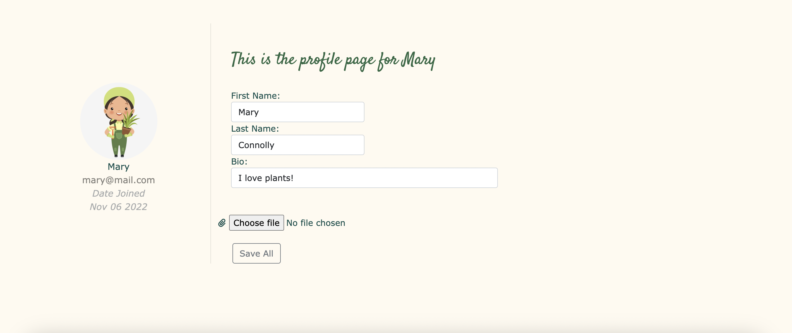

### Sign-in

- The Sign up page requires username and password to sign in, including a "forgot password" section.

### Register

- The register page requires specific information to sign up for a profile, and includes a social media sign in section.

### Newsletter

- The newsletter feature does not show up until you sign into your account, then you can spot it in the Navbar.

- The Newsletter feature allows you to signup for the site's ongoing newsletter with featured posts about plants.
- You can submit your email, after clicking the "Newsletter" button on the Navbar, and from the newsleter page you can choose to be redirected to an unsubscribe page to unsubscribe your email from the newsletter.
- I came across some issues implementing this feature. Attempts to use GMAIL failed as they took away this feature just this year, I will include an option to check the results of this feature with a free email service called mailtrap.io. 
- From mailtrap.io it is possible to see the template newsletter is being sent and linking the email used by the user.

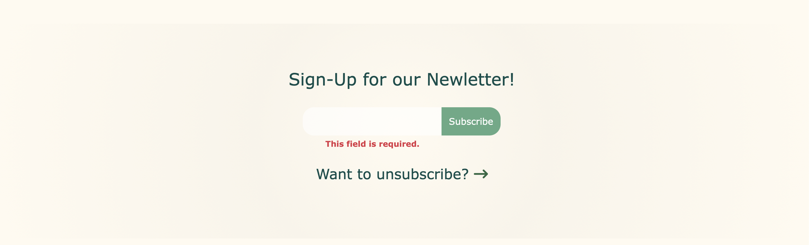
 

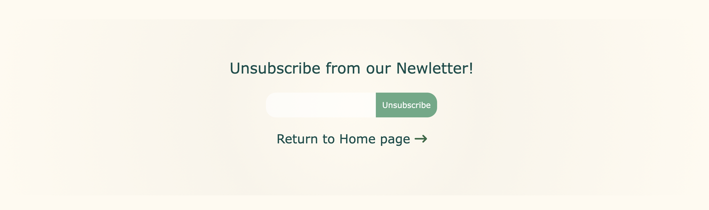

- Once you unsubscribe, you will see a message confirming that your email has been removed from the database.

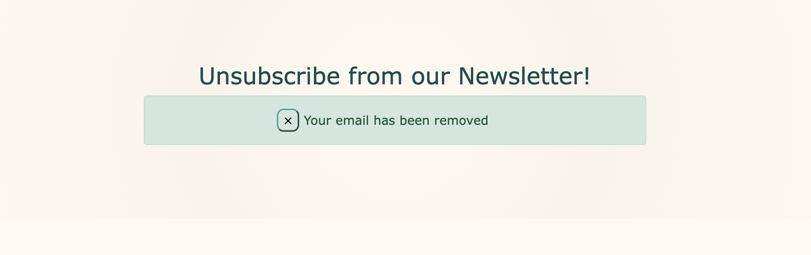

### CRUD 

  | Operations                        | All users | Auth. user | Superuser |
  | --------------------------------- | --------- | ---------- | --------- |
  | View homepage                     | Yes       | Yes        | Yes       |
  | View featured page                | Yes       | Yes        | Yes       |
  | View profile page                 | No        | Yes        | Yes       |
  | Add email to newsletter           | Yes       | Yes        | Yes       |
  | Delete email from newsletter db.  | Yes       | Yes        | Yes       |
  | Add/Edit/Delete profile           | No        | Yes        | Yes       |
  | Add/Delete/Edit blog post.        | No        | No         | Yes       |
  | Login                             | No        | Yes        | Yes       |
  | Register                          | Yes       | No         | No        |
  | View all comments                 | Yes       | Yes        | Yes       |
  | Add a comment                     | No        | Yes        | Yes       |
  | Edit/Delete a comment             | No        | No         | Yes       |

### Defensive Design 
- #### **Delete operations:**
    - **Users** first need to confirm that they are sure that they want to delete:
    - The user account.

    - **Admin** first need to confirm that they are sure they want to delete:
    - Blog Posts

- #### **Comment status:**
 - Comments can be written only by authorised users after logging in.
    - If the admin does not approve the review:
        - Comment will not be displayed on the blog post page comment section.
    - In the comments section in the blog post, a box will display information:
    

- If the admin approves the review:
    - In the comments section you will see the comment displayed:
    

- #### **Admin user mode:**
- Authorised admin login allows for a few small features to allow easy access to edit and create posts from the webpage directly: 
    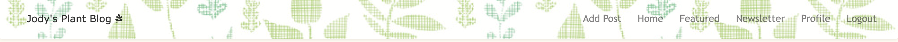
- Authorised admin can add a blog post:
    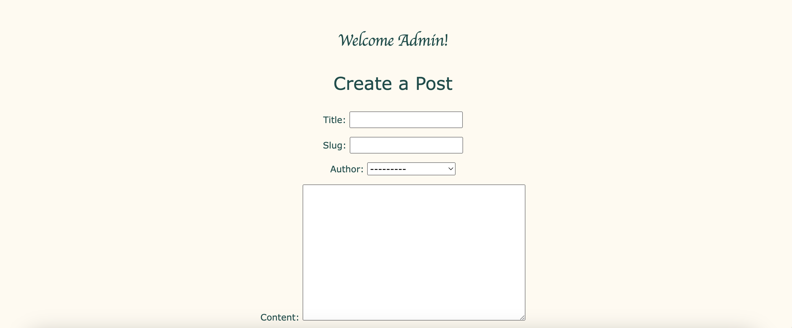
- Authorised admin can also edit or delete blog posts from each post page:
    

## Technologies Used
### **Languages Used**
- [HTML](https://html.spec.whatwg.org/multipage/)
- [CSS](https://www.w3.org/Style/CSS/Overview.en.html)
- [Javascript](https://developer.mozilla.org/en-US/docs/Web/JavaScript)
- [Python](https://www.python.org/)

### Databases platform and cloud storage

- SQlite: SQL database engine provided by default as part of Django and used during development.
- Heroku Postgres: SQL database service provided directly by Heroku for storing data.
- Cloudinary: to store images and static files in production.
- Heroku: to deploy and run the application in production.

### Python Libraries and API

- Google Fonts - for the font families: 
- Font Awesome - to add icons to the social links in the footer element.
- GitPod - to create my html files & styling sheet before pushing the project to Github.
- GitHub - to store my repository for submission.
- Balsamiq - were used to create mockups of the project prior to starting.
- Am I Responsive? - to ensure the project looked good across all devices.
- Favicon - to provide the code & image for the icon in the tab bar.
- Django
- Bootstrap

