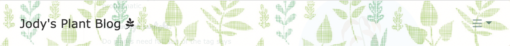
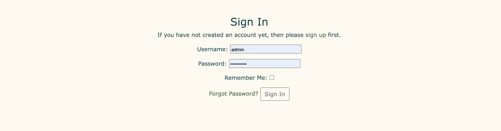
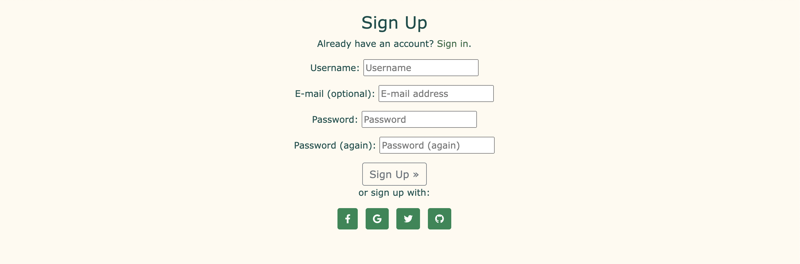
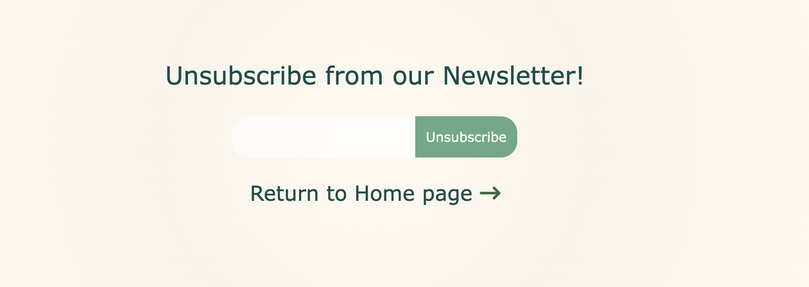
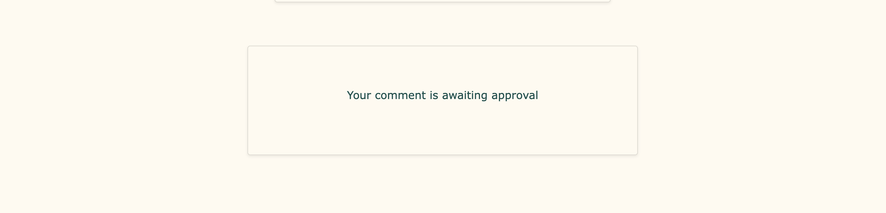
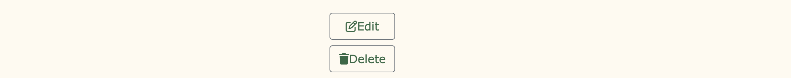

# **Jody's Plant Blog**

This is a blog for plant lovers, the site includes blog-like posts, sign-up and edit profile section, featured posts and a newsletter sign-up. Also included is a feature for admin to easily edit and delete blog posts from each blog post page.

This project is the fourth of five projects that needs to be completed in order to receve a diploma in Software Development from The Code Institute.

A live version of this website will be found here: https://jodys-plants.herokuapp.com/

## **Table of Contents** ##

UX

- [User Demographic](#user-demographic "User Demographic")
- [Site Goals](#site-goals "Site Goals")
- [User Goals](#user-goals "User Goals")
- [Audience](#audience "Audience")

User Stories

- [Site User Stories](#site-user-stories "Site User Stories")
- [Admin Stories](#admin-stories "Admin Stories")

Design

- [Colour Scheme](#colour-scheme "Colour Scheme")
- [Typography](#typography "Typography")
- [Wireframes](#wireframes "Wireframes")
- [Images](#images "Images")

Features

- [NavBar](#navbar "NavBar")
- [Home Landing Page](#home-landing-page "Home Landing Page")
- [Featured Posts](#featured-posts "Featured Posts")
- [Profile Page](#profile-page "Profile Page")
- [Sign-in](#sign-in "Sign-in")
- [Register](#register "Register")
- [Newsletter](#newsletter "Newsletter")
- [CRUD](#crud "CRUD")
- [Defensive Design](#defensive-design "Defensive Design")

Technologies Used

- [Languages Used](#languages-used "Languages Used")
- [Python Libraries and API](#python-libraries-and-api "Python Libraries and API")

Testing

- [Introduction](#introduction "Introduction")
- [Validator testing](#validator-testing "Validator Testing")
- [Testing and bugs](#testing-and-bugs "Testing and bugs")
- [Fixed Bugs and Solutions](#fixed-bugs-and-solutions "Fixed Bugs and Solutions") 
- [Unfixed Bugs](#unfixed-bugs "Unfixed Bugs")
- [Future plans to implement](#future-plans-to-implement "Future plans to implement")

Deployment

- [Deployment](#deployment "Deployment")

Acknowledgements

- [Acknowledgements](#acknowledgements "Acknowledgements")

Sources

- [Sources](#sources "Sources")
- [Media and content](#media-and-content "Media and content")

------------------------------------------------------------------------------------------------------------

## **UX**

### **User Demographic**

This application has been designed for users of all ages who love to garden and learn new things about plants.
It also includes a feature to create and personalise a profile with a profile picture and a biography entry, and with this you can comment on blog posts, to give more advice or ask questions!

### **Site Goals**

To build a platform to allow users to read blog posts, make a profile and comment on posts and allow them to also sign up for a newsletter sent to their email. Also included is admin access through the website for the admin to add, update or delete posts from each blog post page. Which allows the admin to easily see how a post would look with just the click of a button.

### **User Goals**
To engage with topics that interest them, make a personalised profile to feel welcome to the site and encourages them to explore the site and all it has to offer.

### **Audience**
For anyone who has an interest in plants and gardening of all sorts! Users of all ages and all levels of skills in gardening.

## **User Stories**
Not all stories have been implemented. Some have been left for future implementations as the site grows and expands.
Such as:

    * As a Site User I can update my password so that reset it if forgotten.

### **Site User Stories**
- I can update and personalise a profile page so that other users can see my posts.
- I can like or unlike a post so that I can interact with the content and support advice
- I can view comments on an individual post so that I can read the conversation
- I can make an account so that I can comment and like posts
- I can click on a post so that I can read the full post.
- I can view a paginated list of posts so that easily select a post to view
- I can view the number of likes on each post so that I can see which posts are popular.
- I can apply for a newsletter on the featured page so that I can receive updates on the features
- I can view a list of posts so that I can read posts like a news feed.

### **Admin Stories**
As an admin:
- I can submit new blog posts so that I can inform site visitors & fans of the site of new newsletters, featured posts that season, and more.
- I can add a themed page with tips so that I can add a theme to the page
- I can create draft posts so that I can save content for later.
- I can update and personalise a profile page so that other users can see my posts.
- I can approve or disapprove comments and posts so that I can filter unnecessary comments or posts.
- I can create a log in / sign up page so that plant enthusiasts and visitors can sign up to the site.
- I can view comments on an individual post so that I can read the conversation
- I can view the number of likes on each post so that I can see which posts are popular.
- I can apply for a newsletter on the featured page so that I can receive updates on the features

*Won`t have label*
Labelled "Won't have" in issues:
- As a Admin I can host events in relation to gardening so that users can meet up and get to know each other.
- As a Site User I can sign up for events from the group so that I can be included.
- 

## **Design**

### **Colour Scheme**

The colour scheme chosen works with the theme of the topic chosen for the website. 
- The colour chosen for headings is #2F6844.
- The background colour is an easy on the eyes light green #FFFAF0.
- And the hovered over buttons turn a light shade of grey thanks to bootstrap secondary theme.

 

### **Typography**

All fonts are from the Google Fonts library.The following fonts were chosen for the page:

- 'Trebuchet MS', 'Lucida Sans Unicode', 'Lucida Grande', 'Lucida Sans', Arial, sans-serif for the navbar.
- Satisfy font for each page heading and the heading for the user's profile page.
- Verdana, Geneva, Tahoma, sans-serif for the body font and content.
- Pacifico font for the headings in the "health" section on the home page.

### **Wireframes**

The first Wireframe image shows the blog posts in a set of 6, later the pagination was changed. The purpose of this was to lessen the bulk on the index page content wise.

 

 

This last wireframe image has the newsletter section at the end of the page, which later was changed to include it on a separate HTML page.

### **Images**

- All images were found through google and stored using Cloudinary.

## **Features**

### **NavBar**

- The Navbar is sticky, so it can show login options constantly and home page redirection.

- For responsive design, the Navbar collapses into a dropdown menu for screens 768px and below.

### **Home Landing Page**

- The landing/home page brings you to the blog posts.
- Each card brings you to the blog post page, featuring tips, images and a comment and like section.

- Scrolling down the index page we have a "Quick Tips Section":

- A common mistakes section:

- A section on why plants are good for your health:

- And finally for the landing page, the Footer:

### **Featured Posts** 

- Featured posts is an option in the Navbar and brings you to a HTML with two cards, which would ideally be changed seasonly.

- The first Featured Post is called "Winter is Coming":

- The other card features a post all regarding pets and their safety, along with how to keep the plants safe too!

### **Profile Page**

- Once you sign up to a profile, you'll get redirected to your very own Profile page which you can edit by adding your name, profile picture and a bio!
- Also featured is a message that pops up indicating a successful login!

- Here is the edit profile page:
- Updating your profile will show a success message on the index page.

### **Sign-in**

- The Sign up page requires username and password to sign in, including a "forgot password" section.

### **Register**

- The register page requires specific information to sign up for a profile, and includes a social media sign in section.

### **Newsletter**

- The newsletter feature does not show up until you sign into your account, then you can spot it in the Navbar.

- The Newsletter feature allows you to signup for the site's ongoing newsletter with featured posts about plants.
- You can submit your email, after clicking the "Newsletter" button on the Navbar, and from the newsleter page you can choose to be redirected to an unsubscribe page to unsubscribe your email from the newsletter.
- I came across some issues implementing this feature. Attempts to use GMAIL failed as they took away this feature just this year, I will include an option to check the results of this feature with a free email service called mailtrap.io. 
- From mailtrap.io it is possible to see the template newsletter is being sent and linking the email used by the user.

 

- Once you unsubscribe, you will see a message confirming that your email has been removed from the database.

### **CRUD**

  | Operations                        | All users | Auth. user | Superuser |
  | --------------------------------- | --------- | ---------- | --------- |
  | View homepage                     | Yes       | Yes        | Yes       |
  | View featured page                | Yes       | Yes        | Yes       |
  | View profile page                 | No        | Yes        | Yes       |
  | Add email to newsletter           | Yes       | Yes        | Yes       |
  | Delete email from newsletter db.  | Yes       | Yes        | Yes       |
  | Add/Edit/Delete profile           | No        | Yes        | Yes       |
  | Add/Delete/Edit blog post.        | No        | No         | Yes       |
  | Login                             | No        | Yes        | Yes       |
  | Register                          | Yes       | No         | No        |
  | View all comments                 | Yes       | Yes        | Yes       |
  | Add a comment                     | No        | Yes        | Yes       |
  | Edit/Delete a comment             | No        | No         | Yes       |

### **Defensive Design**
- #### **Delete operations:**
    - **Users** first need to confirm that they are sure that they want to delete:
        - Their profile.

    IMAGE

    - **Admin** first need to confirm that they are sure they want to delete:
        - Blog Posts

    IMAGE

- #### **Comment status:**
 - Comments can be written only by authorised users after logging in.
    - If the admin does not approve the review:
        - Comment will not be displayed on the blog post page comment section.
    - In the comments section in the blog post, a box will display information:
    

- If the admin approves the review:
    - In the comments section you will see the comment displayed:
    

- #### **Admin user mode:**
- Authorised admin login allows for a few small features to allow easy access to edit and create posts from the webpage directly: 
    
- Authorised admin can add a blog post:
    
- Authorised admin can also edit or delete blog posts from each post page:
    

## Technologies Used
### **Languages Used**
- [HTML](https://html.spec.whatwg.org/multipage/)
- [CSS](https://www.w3.org/Style/CSS/Overview.en.html)
- [Javascript](https://developer.mozilla.org/en-US/docs/Web/JavaScript)
- [Python](https://www.python.org/)

### **Databases platform and cloud storage**

- ElephantSQL Postgres: database service provided by ElephantSQL for data storage.
- SQLite: SQL database engine used by default as part of Django Framework and used during development.
- Heroku Postgres: SQL database service provided directly by Heroku for storing data.
- Cloudinary: to store images and static files in production.
- Heroku: to deploy and run the application in production.

### **Python Libraries and API**

The following is a list of resources used to put this project together.

- Google Fonts - for the font families: 
- Font Awesome - to add icons to the social links in the footer element.
- GitPod - to create my html files & styling sheet before pushing the project to Github.
- GitHub - to store my repository for submission.
- Balsamiq - were used to create mockups of the project prior to starting.
- Am I Responsive? - to ensure the project looked good across all devices.
- Icons8 - to provide the code & image for the icon in the tab bar.
- Crispy Forms: used for comment and sign-in forms throughout website.
- Google Lighthouse: used to access website performance.
- Coverage.py: used for coverage testing of Python programs. 
- HTML Markup Validation: used to validate HTML code syntax.
- CSS Validation Service: used to validate CSS code syntax.
- PEP8 Validation: used to validate Python code syntax.
- Chrome DevTools: development tool supplied by Google Chrome browser to test responsive design during development.
- Pillow: This library provides extensive file format support, an efficient internal representation, and fairly powerful image processing capabilities.
- MailTrap: Free mail platform used for newsletter.
- Django: Python-based framework for rapid website development.
- Bootstrap: CSS and JavaScript library.

## **Testing**

### **Introduction**

* This project has been continuously tested throughout development stages using the following features:
    * Python terminal for backend functionalities
    * Google Developer Tools 
    * Manual Testing
    * Automated Testing

### **Validator testing**

- HTML files pass through the [W3C validator](https://validator.w3.org/) 

    

- CSS files pass through the [Jigsaw validator](https://jigsaw.w3.org/css-validator/)

    

- No custom JavaScript code has been written for this project, only what is included with Bootstrap4.

* **Lighthouse testing**

* **Python Validator**
- Pep8

### **Testing and bugs**
## **Fixed bugs and solutions:**

* Navigation bar links were too large for smaller screen size,  
    * *Solution: a dropdown burger menu was added for screen sizes 768px and less.*
* The Newsletter was originally planned for the Home page, but again it was adding bulk to the home page. 
    * *Solution: it was changed to it's own HTML page as well as the unsubscribe section for the Newsletter.*
* The Newsletter feature was difficult to implement for me. GMAIL service was attempted, but they have taken away this feature since this year. 
    * *Solution: I used a free mail service which the login will be included so it can be shown that an email template is sent for subscribing and unsubscribing to our newsletter.*
* The blog posts were taking up a lot of space, especially on smaller screens, the list of posts seemed never ending.
    * *Solution: the pagination was changed to three posts per page, which solved the bulky page issue.* 
* When the admin goes into the "Add Post" section, the available inputs result in a "blog post" which is not very styled.
    * *Solution: Not entirely a solution, but a way around this, it's possible to add HTML elements such as headings, page breaks and font styles as well. Which takes a long time, but is an easy solution, and it's as quick as doing it through the ADMIN section in Django, but results are easier to see on the page.*
* Delete profile feature threw an error once the profile was deleted, flagging the profile picture; saying threre was no file associated with it. 
    * *Solution: I added an else if statement to the model which uses a default image if no image is used.*

## **Unfixed bugs**

* The profile picture shows up beside each comment made by the user, instead only showing up is the logged in user's profile picture.
* When a user "deletes" their profile from the "edit profile" page, it only deletes their profile information and profile picture and not the user account itself.
* The comment box in each blog post gets pushed to the side a bit when logged in as admin, because of the delete and edit buttons.

## **Future plans to implement**
Future plans for this project include:
* The Newsletter section I would like to get working properly with an email direct to an actual account instead of the free mail service (mailtrap.io). This is definitely possible, services such as MailChimp and SendGrid allow for this feature. 
* The profile picture beside the comments made by each user is an issue that should be resolved in the future.
* The user should in the future be able to delete their whole user account and not just their profile information.
* Also to implement in the future, the capability to sign in using Social medias, for now, the links added in the sign up section will just bring you to the social media site.
* Ideally the "Featured Posts" section would change seasonally, giving us new seasonally related tips and content regarding the seasonal changes that come along with gardening.

### **Deployment**
The site was deployed to Heroku. The steps to deploy are as follows:
- Install Django & Gunicorn:
*pip3 install 'django<4' gunicorn*
- Install Django database & psycopg:
*pip3 install dj_database_url psycopg2*
- Install Cloudinary:
*pip3 install dj3-cloudinary-storage*
- Creating the requirements.txt file with the following command:
*pip3 freeze --local > requirements.txt*
- a django project was created using:
*django-admin startproject plantblog*
- the blog app was then created with:
*python3 manage.py startapp blog*
- which was then added to the settings.py file within our project directory.
- the changes were then migrated using:
*python3 manage.py migrate*
- navigated to [Heroku](www.heroku.com) & created a new app called print-statements.
- added the Heroku Postgres database to the Resources tab.
- navigated to the Settings Tab, to add the following key/value pairs to the configvars:
    * key: SECRET_KEY | value: randomsecretkey22
    * key: PORT | value: 8000
    * key: CLOUDINARY_URL | value: API environment variable
    * key: DATABASE_URL | value: value supplied by Heroku
- added the DATABASE_URL, SECRET_KEY & CLOUDINARY_URL to the env.py file
- added the DATABASE_URL, SECRET_KEY & CLOUDINARY_URL to the settings.py file
- add an import os statement for the env.py file.
- added Heroku to the ALLOWED_HOSTS in settings.py
- created the Procfile
- pushed the project to Github
- connected my github account to Heroku through the Deploy tab
- connected my github project repository, and then clicked on the "Deploy" buttons

### **Acknowledgements**

For inspiration, for code, design help and advice, I'd like to thank;

* Martina Terlevic
    * My wonderful mentor at Code Institute.
     
* The Code Institute.

### **Sources**
Sites that provided me with helpful information and resolved many of my issues;
- https://www.w3schools.com/
- https://stackoverflow.com/
- https://youtube.com/

The top screen shot for responsive design was taken from: 
- https://ui.dev/amiresponsive

Some tutorials that helped me along the way:
* https://www.youtube.com/watch?v=m3efqF9abyg
* https://www.youtube.com/watch?v=yZPgBThZT04&list=PLGzru6ACxEAKtb29AeyHbVGUh2-0r891H&index=27

### **Media and content**

- Google: For images.
- https://getcssscan.com/css-box-shadow-examples: for box shadow example.
- https://getbootstrap.com/docs/4.1: for card, columns, and signup pages.
- https://freefrontend.com/: for CSS and Bootstrap inspirations

Thank you

[Back to top](#jodys-plant-blog)

